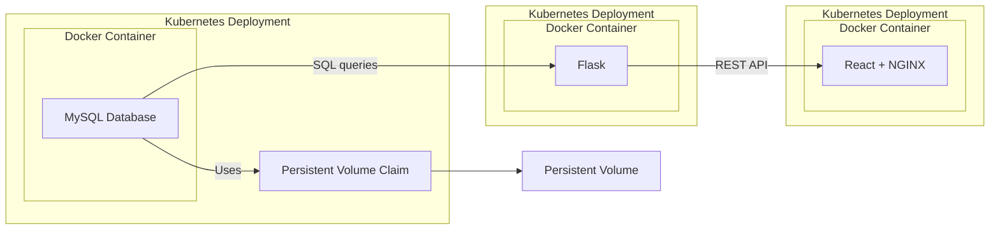

# Project Design

This design document provides an overview, architectural details, technology stack, and deployment strategy for our dog adoption and fostering application.

## Overview

This application is designed to facilitate the adoption and fostering of dogs by providing an interactive platform where users can browse available dogs and submit adoption requests. It is built with a focus on scalability, security, and efficient deployment using Docker and Kubernetes.

## Architecture

The architecture consists of three primary components:
1. **MySQL Database**: Serves as the data storage with persistent volume.
2. **Flask Backend**: Connects the database and frontend through REST API.
3. **React Frontend**: Provides a user-friendly interface served through Nginx.

These components are containerized with Docker and orchestrated using Kubernetes for enhanced manageability and scalability. The diagram below shows the system architecture. The architecture clearly illustrates the individual containers and how they are interconnected. The database container stores the data, the React container is responsible for presenting them, and the Flask container manages the data flow between the two.

## Technologies

The following technologies and tools are used in the application:

- **Docker**: Used for containerizing each component.
- **Kubernetes**: Manages and orchestrates containers, ensuring high availability and scalability.
- **MySQL**: The database technology used for data storage.
- **Flask**: The framework used for the backend REST API, facilitating data exchange between the frontend and database.
- **React**: The core framework for building the user interface.
- **Bootstrap**: A library used to provide styling and responsive layout.
- **Nginx**: Serves the React frontend.

## Deployment

The application is deployed using the following strategy:

- **Docker Images**: Each component is containerized, ensuring consistency across development and production.
- **Kubernetes Orchestration**: Kubernetes is used to manage Docker containers, enabling features like load balancing and horizontal auto-scaling.
- **Persistent Volume**: Used for the MySQL database.

### Services

- **Flask App Service**: Exposes the Flask backend application, allowing external clients to send requests to it. LoadBalancer type.
- **MySQL Service**: Allows Flask app to connect to the MySQL database. ClusterIP type - only accessible within the cluster.
- **React Frontend Service**: Exposes the React application to external users. NodePort type.

### Infrastructure Requirements

- **Kubernetes Cluster**: Ensures that all services are scalable and manageable.
- **Persistent Storage**: Supports the MySQL database to retain data reliably.

### Security
To enhance security, the application implements several measures:

- **Kubernetes Secrets**: for sensitive information such as database credentials
- **Resource Restrictions**: to prevent any single application from consuming too many resources.
- **Horizontal Pod Autoscaler**: for the Flask backend to mitigate DoS attacks

### Health and Liveness Checks

Backend and frontend deployments include health checks to monitor the status of the application.

### Scalability

Scalability is achieved through:

- **Load Balancing**: for backend.
- **Auto-scaling**: for backend.

## Unit tests
Project contains a set of unit tests for frontend and backend.

**Frontend unit tests**
- check correct rendering and functioning of the components
- check correct and incorrect form submittion.

**Backend unit tests**
- check API endpoints
- consider both successful and unsuccessful database operations.

## Documentation
More detailed description is available in the [documentation](https://github.com/dat515-2024/KaSo/tree/main/documentation).
